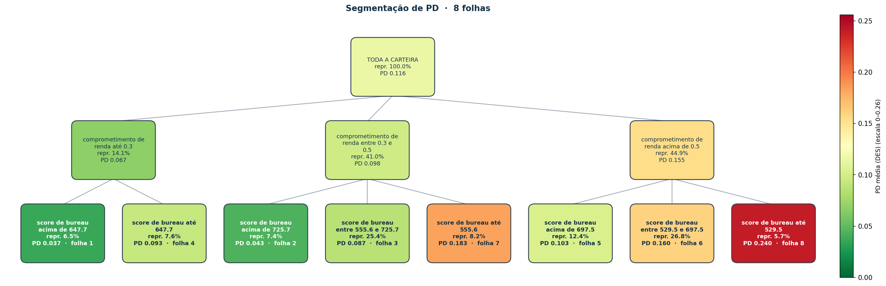
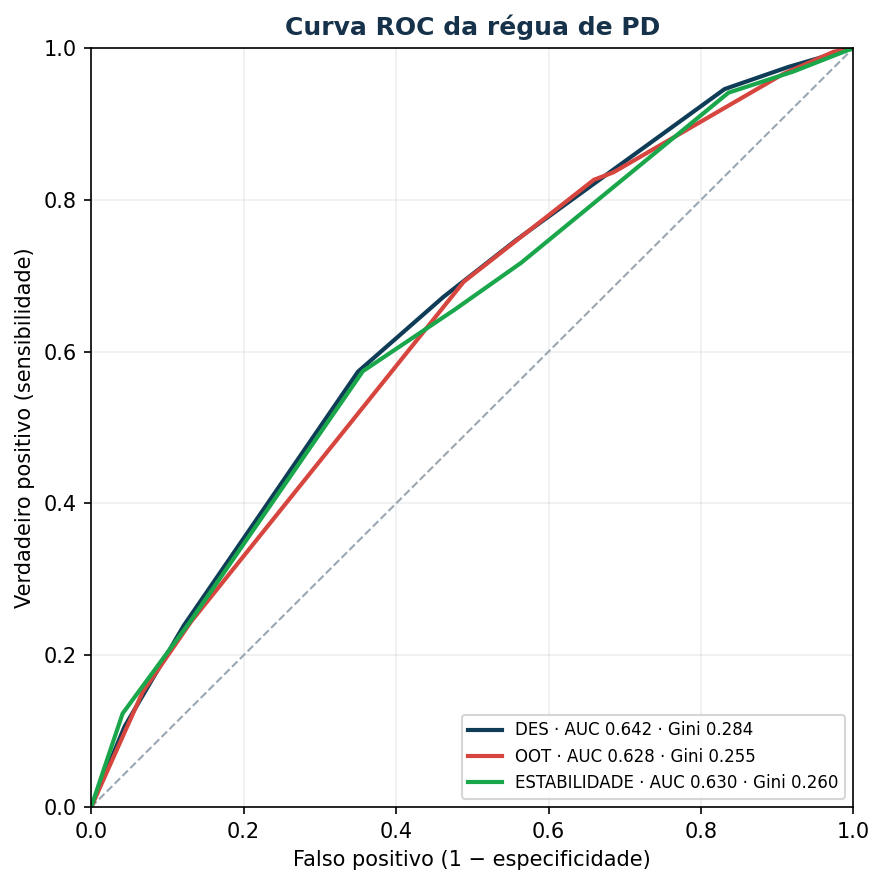
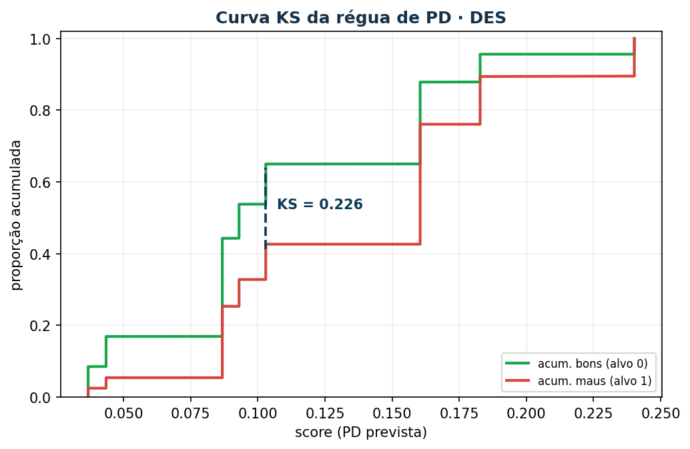
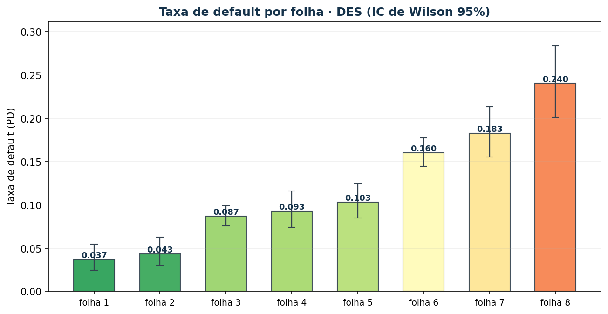

# Tutorial — `SequentialPDSegmenter`

Construtor sequencial e híbrido de segmentações para modelos de **PD** (Probability of Default), pensado para uso sob **Resolução CMN 4.966/2021** e **IFRS 9**. É o gêmeo de **classificação** do [`SequentialLGDSegmenter`](lgd-segmenter.md): a mesma máquina de árvore, mas com **alvo binário** (0 = adimplente, 1 = default) e avaliação de **discriminação** — **KS, ROC/AUC, Gini, Acurácia e F1**.

A ideia: você **cresce a segmentação em camadas**, e a cada camada divide cada folha por uma nova variável usando **optimal binning binário** (automático) **ou cortes manuais** (política de negócio). Os bins resultantes viram, ao mesmo tempo, a régua de PD (taxa de default por folha) e o esquema de bins do PSI.

> Se você já conhece o módulo de LGD, a transição é direta: troque `lgd` por `pd`, "LGD médio" por "taxa de default (PD)", e ganhe as métricas e os gráficos de classificação. A tabela de diferenças está no [README do módulo](../../src/yggdrasil/credit_risk/pd/README.md#diferenças-em-relação-ao-credit_risklgd).

---

## O que a classe faz

| Método | Função |
|---|---|
| `show_grow(...)` | **Preview** do split (PD média + representatividade) sem alterar nada |
| `grow(...)` | Efetiva o split — optimal binning **ou** cortes manuais; variável **numérica ou categórica** |
| `prune(...)` | Poda por fusão de folhas-irmãs sem materialidade ou sem separação de PD |
| `leaves()` | Tabela final de segmentos-folha: **nota de PD (1..N)**, **descrição por extenso**, PD por amostra (DES/OOT/...) |
| `tree()` / `plot_tree()` | Desenha a **árvore hierárquica** (texto e imagem), colorida pela PD |
| `psi()` / `psi_detalhe()` | PSI de estabilidade contra DES, usando os segmentos como bins |
| `variable_iv(...)` / `suggest_split(...)` | **IV (WoE binário)** por variável na folha; recomenda a de maior poder de separação |
| `metrics()` | Avalia a régua como **modelo de PD**: **KS, AUC, Gini, Acurácia e F1** por amostra |
| `plot_roc()` / `plot_ks()` | Curva **ROC** (AUC/Gini) e curva **KS** da régua |
| `plot_leaf_badrate()` / `plot_score_distribution()` | Taxa de default por folha (IC de Wilson) e separação do score por classe |
| `assign(...)` | Rotula cada linha: id do segmento, **nota de PD** e **descrição por extenso** |

Princípios de design relevantes para validação independente:

- **Optimal binning binário ajustado só em DES** quando há `sample_col` — a janela OOT nunca influencia onde os cortes caem, então o PSI mede deslocamento genuíno de população, não vazamento.
- **`monotonic_trend="auto_asc_desc"`** — a `OptimalBinning` detecta sozinha se a taxa de default sobe ou desce em cada ramo.
- **Crescimento ramo a ramo** — os cortes de `score_bureau` dentro do ramo "comprometimento baixo" podem diferir dos cortes no ramo "comprometimento alto", refletindo o comportamento real da PD.
- **`history`** guarda modo (ótimo/manual) e cortes de cada passo — documentação de auditoria direta.

---

## Instalação

O segmentador faz parte do pacote **Yggdrasil**, no subpacote de domínio
`yggdrasil.credit_risk.pd`. Em modo de desenvolvimento (na raiz do repositório):

```bash
pip install -e .            # núcleo (numpy, pandas, optbinning, scikit-learn)
pip install -e ".[ui]"      # + interface ipywidgets (Jupyter/Databricks)
pip install -e ".[ui,spark,dev]"   # + ui, pyspark e testes
```

Importe com:

```python
from yggdrasil.credit_risk.pd import SequentialPDSegmenter
```

---

## Exemplo prático — PD de crédito ao consumidor

O exemplo abaixo é **executável e reproduz exatamente as saídas mostradas**. Gera uma base sintética com três amostras (DES, OOT, ESTABILIDADE) onde a probabilidade de default **sobe** com o comprometimento de renda, **cai** com o score de bureau e com o tempo de relacionamento, e depende do tipo de garantia — e injeta um **drift de originação na janela OOT** (comprometimento de renda mais alto) para o PSI ter o que detectar.

### Passo 0 — Base sintética

```python
import numpy as np
import pandas as pd
from yggdrasil.credit_risk.pd import SequentialPDSegmenter

rng = np.random.default_rng(42)
GAR = {"alienacao_fiduciaria": -0.55, "aval": 0.15,
       "fianca_bancaria": 0.45, "sem_garantia": 1.05}

def gera_amostra(n, drift=False):
    comp  = rng.beta(2.5 if not drift else 3.6, 3.0, n) * 0.8 + 0.1   # comprometimento de renda
    score = np.clip(rng.normal(640, 95, n), 300, 900)                # score de bureau
    relac = rng.integers(0, 120, n)                                  # meses de relacionamento
    gar   = rng.choice(list(GAR), n, p=[0.50, 0.22, 0.18, 0.10]).astype(object)
    # PD via logística (alvo BINÁRIO 0/1)
    lin = (-2.15 + 2.6 * (comp - 0.4) - 0.0045 * (score - 640)
           - 0.004 * relac + np.array([GAR[g] for g in gar]))
    p = 1 / (1 + np.exp(-lin))
    target = (rng.uniform(0, 1, n) < p).astype(int)
    return pd.DataFrame({
        "comprometimento_renda": comp, "score_bureau": score,
        "meses_relacionamento": relac, "tipo_garantia": gar, "target": target,
    })

des = gera_amostra(8000);              des["amostra"] = "DES"
oot = gera_amostra(3000, drift=True);  oot["amostra"] = "OOT"
est = gera_amostra(3000);              est["amostra"] = "ESTABILIDADE"
df = pd.concat([des, oot, est], ignore_index=True)

df.groupby("amostra")["target"].mean().round(4)
```
```
amostra
DES             0.1155
ESTABILIDADE    0.1190
OOT             0.1363
```

A taxa de default é a **PD observada** da amostra. O OOT já vem mais arriscado (13.6% vs 11.6% no DES) por causa do drift de comprometimento de renda.

### Passo 1 — Instanciar com amostras e referência do PSI

O parâmetro opcional `feature_labels` define rótulos amigáveis por variável, usados na descrição por extenso de cada segmento (Passo 6.1). O `target` é a **coluna binária** (0/1).

```python
labels = {
    "comprometimento_renda": "comprometimento de renda",
    "score_bureau": "score de bureau",
    "meses_relacionamento": "meses de relacionamento",
    "tipo_garantia": "tipo de garantia",
}

seg = SequentialPDSegmenter(
    df, target="target", sample_col="amostra", ref_sample="DES",
    feature_labels=labels,
)
```
```
[init] amostras: ['DES', 'OOT', 'ESTABILIDADE'] | referência PSI = DES
```

### Passo 2 — Preview do split manual de comprometimento de renda

Antes de efetivar, veja a **taxa de default (PD)** média e a representatividade dos cortes de política propostos. Nada é alterado.

```python
seg.show_grow("comprometimento_renda", splits=[0.30, 0.50])
```
```
┌─ PREVIEW: dividir 'root'
│  feature = comprometimento_renda | tipo = num | modo = manual
│  monotonicidade da PD respeitada: True
                             faixa    n  repr_%  pd_medio  pd_std
comprometimento_renda: (-inf, 0.3] 1976    14.1    0.0663  0.2489
 comprometimento_renda: (0.3, 0.5] 5743    41.0    0.0993  0.2990
 comprometimento_renda: (0.5, inf] 6281    44.9    0.1575  0.3643
```

A PD sobe de 6.6% → 9.9% → 15.8% de forma monotônica e nenhum bin é frágil. Pode efetivar. (Para alvo binário o `pd_std` é o desvio binomial; o que importa é o `pd_medio`, a taxa de default da faixa.)

### Passo 3 — Crescer: comprometimento manual, depois score ótimo

Os dois modos no mesmo segmentador. O score de bureau é binado **dentro de cada faixa de comprometimento**, e os cortes são definidos só pela amostra DES.

```python
seg.grow("comprometimento_renda", splits=[0.30, 0.50])   # manual (política)
seg.grow("score_bureau", max_n_bins=3)                    # ótimo (OptimalBinning, só DES)
```
```
[grow] 'comprometimento_renda' (manual) criou 3 segmentos. Folhas atuais: 3
[grow] 'score_bureau' (ótimo) criou 9 segmentos. Folhas atuais: 9
```

### Passo 4 — Folhas antes da poda

```python
cols = ["segmento", "profundidade", "n", "repr_%", "pd_medio",
        "pd_DES", "pd_OOT", "pd_ESTABILIDADE"]
print(seg.leaves()[cols].to_string(index=False))
```
```
                                                         segmento  profundidade    n  repr_%  pd_medio  pd_DES  pd_OOT  pd_ESTABILIDADE
  comprometimento_renda: (-inf, 0.3] | score_bureau: (647.7, inf]             2  912     6.5    0.0368  0.0368  0.0290           0.0505
   comprometimento_renda: (0.3, 0.5] | score_bureau: (725.7, inf]             2 1041     7.4    0.0435  0.0435  0.0652           0.0424
comprometimento_renda: (-inf, 0.3] | score_bureau: (514.5, 647.7]             2  865     6.2    0.0754  0.0754  0.0364           0.0750
 comprometimento_renda: (0.3, 0.5] | score_bureau: (555.6, 725.7]             2 3550    25.4    0.0868  0.0868  0.0841           0.1001
   comprometimento_renda: (0.5, inf] | score_bureau: (697.5, inf]             2 1730    12.4    0.1029  0.1029  0.1104           0.0833
 comprometimento_renda: (0.5, inf] | score_bureau: (529.5, 697.5]             2 3753    26.8    0.1604  0.1604  0.1650           0.1643
 comprometimento_renda: (-inf, 0.3] | score_bureau: (-inf, 514.5]             2  199     1.4    0.1742  0.1742  0.1333           0.1346
  comprometimento_renda: (0.3, 0.5] | score_bureau: (-inf, 555.6]             2 1152     8.2    0.1828  0.1828  0.1872           0.1558
  comprometimento_renda: (0.5, inf] | score_bureau: (-inf, 529.5]             2  798     5.7    0.2402  0.2402  0.2616           0.2876
```

Repare na folha frágil: `comprometimento_renda: (-inf, 0.3] | score_bureau: (-inf, 514.5]` tem só **1.4%** da carteira (199 contratos, 35 maus). Para PD, caudas pequenas dão taxas erráticas e ICs largos — é o que a poda resolve.

### Passo 5 — Podar

`prune` funde pares de **folhas-irmãs** (mesmo pai) quando **alguma folha tem `repr_%` abaixo do mínimo** (materialidade) **ou a diferença de PD entre as irmãs é pequena demais** (`min_pd_gap` — sem separação que justifique segmentar). Itera até estabilizar.

```python
seg.prune(min_repr=3.0, min_pd_gap=0.03)
```
```
[prune] folhas-irmãs unidas (repr.)
[prune] 1 fusão(ões) (repr<3.0% ou ΔPD<0.03). Folhas finais: 8
```

A folha imaterial de 1.4% foi fundida à irmã adjacente em PD, deixando o ramo de comprometimento baixo com duas faixas de score (`acima de 647.7` e `até 647.7`) — ambas materiais.

### Passo 6 — Folhas finais

```python
print(seg.leaves()[cols].to_string(index=False))
```
```
                                                        segmento  profundidade    n  repr_%  pd_medio  pd_DES  pd_OOT  pd_ESTABILIDADE
 comprometimento_renda: (-inf, 0.3] | score_bureau: (647.7, inf]             2  912     6.5    0.0368  0.0368  0.0290           0.0505
  comprometimento_renda: (0.3, 0.5] | score_bureau: (725.7, inf]             2 1041     7.4    0.0435  0.0435  0.0652           0.0424
comprometimento_renda: (0.3, 0.5] | score_bureau: (555.6, 725.7]             2 3550    25.4    0.0868  0.0868  0.0841           0.1001
comprometimento_renda: (-inf, 0.3] | score_bureau: (-inf, 647.7]             2 1064     7.6    0.0930  0.0930  0.0571           0.0873
  comprometimento_renda: (0.5, inf] | score_bureau: (697.5, inf]             2 1730    12.4    0.1029  0.1029  0.1104           0.0833
comprometimento_renda: (0.5, inf] | score_bureau: (529.5, 697.5]             2 3753    26.8    0.1604  0.1604  0.1650           0.1643
 comprometimento_renda: (0.3, 0.5] | score_bureau: (-inf, 555.6]             2 1152     8.2    0.1828  0.1828  0.1872           0.1558
 comprometimento_renda: (0.5, inf] | score_bureau: (-inf, 529.5]             2  798     5.7    0.2402  0.2402  0.2616           0.2876
```

Régua limpa, com 8 segmentos. As colunas `pd_DES` / `pd_OOT` / `pd_ESTABILIDADE` permitem checar a **estabilidade da própria PD** dentro de cada segmento entre as janelas — pergunta distinta do PSI (que mede deslocamento de população).

### Passo 6.1 — Nota de PD e descrição por extenso

A régua só vira política de negócio quando cada segmento ganha uma **nota ordenada** e uma **descrição legível**. O `leaves()` já entrega as duas: `nota_pd` numera as folhas de 1 a N por ordem de PD (1 = menor PD / melhor risco) e `descricao` traduz o caminho técnico usando os `feature_labels`.

```python
lv = seg.leaves()
print(lv[["nota_pd", "descricao", "repr_%", "pd_medio"]].to_string(index=False))
```
```
 nota_pd                                                                      descricao  repr_%  pd_medio
       1              comprometimento de renda até 0.3 e score de bureau acima de 647.7     6.5    0.0368
       2      comprometimento de renda entre 0.3 e 0.5 e score de bureau acima de 725.7     7.4    0.0435
       3 comprometimento de renda entre 0.3 e 0.5 e score de bureau entre 555.6 e 725.7    25.4    0.0868
       4                   comprometimento de renda até 0.3 e score de bureau até 647.7     7.6    0.0930
       5         comprometimento de renda acima de 0.5 e score de bureau acima de 697.5    12.4    0.1029
       6    comprometimento de renda acima de 0.5 e score de bureau entre 529.5 e 697.5    26.8    0.1604
       7           comprometimento de renda entre 0.3 e 0.5 e score de bureau até 555.6     8.2    0.1828
       8              comprometimento de renda acima de 0.5 e score de bureau até 529.5     5.7    0.2402
```

A nota 1 é o melhor risco (PD 3.7%) e a nota 8 o pior (PD 24%). Para inverter a ordem (nota 1 = maior PD), use `seg.leaves(ascending=False)`. A descrição compõe múltiplas condições com " e " e converte cada intervalo automaticamente: `(-inf, x]` → "até x", `(x, inf]` → "acima de x", `(x, y]` → "entre x e y".

### Passo 6.2 — Visualizar a árvore (`tree` / `plot_tree`)

`leaves()` dá a visão **plana**; `tree()` desenha a **hierarquia inteira**, com n, representatividade e PD média em cada nó, e a nota nas folhas.

```python
seg.tree()
```
```
TODA A CARTEIRA  (n=14000, 100.0%, PD=0.1207)
├─ comprometimento de renda até 0.3  (n=1976, 14.1%, PD=0.0663)
│  ├─ score de bureau acima de 647.7  (n=912, 6.5%, PD=0.0395)  [nota 1]
│  └─ score de bureau até 647.7  (n=1064, 7.6%, PD=0.0893)  [nota 4]
├─ comprometimento de renda entre 0.3 e 0.5  (n=5743, 41.0%, PD=0.0993)
│  ├─ score de bureau acima de 725.7  (n=1041, 7.4%, PD=0.0471)  [nota 2]
│  ├─ score de bureau entre 555.6 e 725.7  (n=3550, 25.4%, PD=0.0893)  [nota 3]
│  └─ score de bureau até 555.6  (n=1152, 8.2%, PD=0.1771)  [nota 7]
└─ comprometimento de renda acima de 0.5  (n=6281, 44.9%, PD=0.1575)
   ├─ score de bureau acima de 697.5  (n=1730, 12.4%, PD=0.1012)  [nota 5]
   ├─ score de bureau entre 529.5 e 697.5  (n=3753, 26.8%, PD=0.1625)  [nota 6]
   └─ score de bureau até 529.5  (n=798, 5.7%, PD=0.2556)  [nota 8]

(8 folhas | profundidade máxima 2)
```

Os filhos são ordenados por PD, então a árvore lê de cima (menor PD) para baixo. As **notas interligam ramos diferentes** (nota 4 num ramo, nota 5 em outro): a numeração é global por PD, não por ramo — exatamente o que você quer numa régua final. `seg.plot_tree(save_path="pd_arvore.png")` gera a versão em imagem, com cada nó colorido pela PD (verde = baixa → vermelho = alta; escala dinâmica, já que a PD costuma ser pequena):



### Passo 7 — PSI de estabilidade (DES como referência)

```python
print(seg.psi().to_string(index=False))
```
```
     amostra    psi classificacao
         OOT 0.2736      instável
ESTABILIDADE 0.0023       estável
```

O PSI capturou o drift injetado em OOT (`0.2736`, faixa instável) e confirmou ESTABILIDADE estável (`0.0023`).

### Passo 8 — De onde vem o PSI

```python
det = seg.psi_detalhe()
det = det.reindex(det["psi_bin"].abs().sort_values(ascending=False).index)
print(det.head(5).to_string(index=False))
```
```
amostra                                                         segmento  %_DES  %_atual  psi_bin
    OOT comprometimento_renda: (-inf, 0.3] | score_bureau: (-inf, 647.7]   9.28     2.33   0.0958
    OOT  comprometimento_renda: (-inf, 0.3] | score_bureau: (647.7, inf]   7.81     2.30   0.0674
    OOT comprometimento_renda: (0.5, inf] | score_bureau: (529.5, 697.5]  24.08    36.97   0.0553
    OOT   comprometimento_renda: (0.5, inf] | score_bureau: (697.5, inf]  11.05    16.60   0.0226
    OOT comprometimento_renda: (0.3, 0.5] | score_bureau: (555.6, 725.7]  26.51    21.00   0.0128
```

A decomposição mostra a causa: as folhas de **comprometimento baixo encolheram** (9.3% → 2.3% e 7.8% → 2.3%) e a massa migrou para **comprometimento alto** (24.1% → 37.0%) — exatamente o drift de originação injetado. É isso que torna o PSI acionável: você aponta *qual* segmento migrou, não só o número agregado.

### Passo 8.1 — Discriminação: a régua como modelo de PD (`metrics`)

Aqui está a diferença central em relação ao LGD. Como o alvo é binário, a régua é avaliada por **poder de discriminação**: o `metrics()` usa como **score** de cada contrato a **PD média do seu segmento na referência (DES)** e calcula, por amostra, **KS, AUC, Gini, Acurácia e F1** (Acurácia/F1 no corte KS-ótimo).

```python
seg.metrics()
```
```
     amostra    n  taxa_default       KS      AUC     Gini  Acuracia       F1
         DES 8000        0.1155 0.223537 0.642201 0.284402  0.641125 0.269651
         OOT 3000        0.1363 0.203317 0.627565 0.255131  0.536000 0.289070
ESTABILIDADE 3000        0.1190 0.217817 0.629834 0.259668  0.635333 0.272606
```

Leitura:

- **KS** = máxima separação entre as acumuladas de bons e maus; **AUC** = probabilidade de a régua ordenar um mau acima de um bom; **Gini = 2·AUC − 1**.
- A queda de KS/AUC do **DES** para o **OOT** mede a **degradação out-of-time** do poder de ordenação — análoga ao que o PSI faz para população, mas para discriminação.
- Com uma folha só (antes de qualquer split) a régua atribui a mesma PD a todos: KS = 0 e AUC = 0.5. Cada split bom os aumenta.
- A discriminação aqui é limitada por construção (a PD é categorizada em 8 níveis e os dados são ruidosos). Numa segmentação real, KS na faixa de 0.30–0.45 é o usual para uma boa régua de PD.

### Passo 8.2 — Curvas ROC e KS

Os mesmos números, em imagem. `plot_roc()` desenha uma curva por amostra (AUC e Gini na legenda); `plot_ks()` mostra as acumuladas de bons e maus ao longo do score, com a distância KS marcada.

```python
seg.plot_roc(save_path="pd_roc.png")
seg.plot_ks(save_path="pd_ks.png")     # por padrão na amostra de referência (DES)
```




### Passo 8.3 — Qual variável separa melhor? (`variable_iv` / `suggest_split`)

Para PD, o **IV é o WoE binário clássico** (escala de Siddiqi). O `variable_iv` calcula, na folha escolhida, o IV de cada variável candidata sobre os bins ótimos, junto com o PSI nesses mesmos bins:

```python
print(seg.variable_iv("root")[["variavel", "tipo", "n_bins", "iv", "forca",
                                "pior_psi", "psi_classificacao"]].to_string(index=False))
```
```
             variavel tipo  n_bins     iv forca  pior_psi psi_classificacao
        tipo_garantia  cat       4 0.2344 médio    0.0011           estável
comprometimento_renda  num       5 0.1707 médio    0.2850          instável
         score_bureau  num       5 0.1565 médio    0.0023           estável
 meses_relacionamento  num       5 0.0379 fraco    0.0025           estável
```

Faixas de força do IV binário: `< 0.02` inútil · `0.02–0.10` fraco · `0.10–0.30` médio · `0.30–0.50` forte · `≥ 0.50` suspeito (alto demais — verifique vazamento). Aqui `tipo_garantia` é a mais informativa (IV 0.234), mas note que `comprometimento_renda` aparece **instável** (PSI 0.285) — informação que pesa na escolha. O `suggest_split` devolve direto a recomendação:

```python
seg.suggest_split("root")
# {'feature': 'tipo_garantia', 'tipo': 'cat', 'iv': 0.2344, 'forca': 'médio',
#  'msg': "dividir por 'tipo_garantia' (IV=0.2344, médio)"}
```

### Passo 9 — Materializar o segmento

```python
df_seg = seg.assign("segmento_pd")
# colunas geradas: segmento_pd, segmento_pd_nota (Int64), segmento_pd_desc
df_seg[["comprometimento_renda", "score_bureau", "target",
        "segmento_pd_nota", "segmento_pd_desc"]].head(8)
```
```
 comprometimento_renda  score_bureau  target  segmento_pd_nota                                                               segmento_pd_desc
              0.414339    633.622794       0                 3 comprometimento de renda entre 0.3 e 0.5 e score de bureau entre 555.6 e 725.7
              0.477680    821.874383       0                 2      comprometimento de renda entre 0.3 e 0.5 e score de bureau acima de 725.7
              0.558971    736.799245       0                 5         comprometimento de renda acima de 0.5 e score de bureau acima de 697.5
              0.475339    650.348148       0                 3 comprometimento de renda entre 0.3 e 0.5 e score de bureau entre 555.6 e 725.7
              0.588900    646.242716       0                 6    comprometimento de renda acima de 0.5 e score de bureau entre 529.5 e 697.5
              0.651985    712.023372       0                 5         comprometimento de renda acima de 0.5 e score de bureau acima de 697.5
              0.478250    514.714393       0                 7           comprometimento de renda entre 0.3 e 0.5 e score de bureau até 555.6
              0.325878    457.471759       0                 7           comprometimento de renda entre 0.3 e 0.5 e score de bureau até 555.6
```

O `assign` adiciona três colunas: `segmento_pd` (id da folha), `segmento_pd_nota` (a nota de PD, tipo `Int64`) e `segmento_pd_desc` (descrição por extenso) — prontas para virar a régua de PD, *feature* categórica do modelo, ou rótulo legível em relatório. Desligue qualquer extra com `add_grade=False` ou `add_desc=False`.

A **taxa de default por folha** (com IC de Wilson) é o gráfico de qualidade dos segmentos — mostra a separação de risco e a incerteza amostral de cada PD:

```python
seg.plot_leaf_badrate(save_path="pd_badrate.png")
```



---

## Crescer apenas um segmento (`only_segments`)

Por padrão, `grow` divide **todas** as folhas atuais. Mas em geral você quer aprofundar **só onde há materialidade ou heterogeneidade**. Tanto `show_grow` quanto `grow` aceitam `only_segments` com a lista de IDs dos segmentos-folha a dividir.

Partindo da segmentação só com comprometimento de renda (3 folhas):

```python
print(seg.leaves()[["segmento", "n", "repr_%", "pd_medio"]].to_string(index=False))
```
```
                          segmento    n  repr_%  pd_medio
comprometimento_renda: (-inf, 0.3] 1976    14.1    0.0673
 comprometimento_renda: (0.3, 0.5] 5743    41.0    0.0978
 comprometimento_renda: (0.5, inf] 6281    44.9    0.1548
```

O ramo `comprometimento_renda: (0.5, inf]` concentra 45% da carteira e a maior PD — vale abrir só ele por score de bureau. **O ID em `only_segments` precisa ser exatamente o que aparece na coluna `segmento`**:

```python
seg.show_grow("score_bureau", max_n_bins=3,
              only_segments=["comprometimento_renda: (0.5, inf]"])
```
```
┌─ PREVIEW: dividir 'comprometimento_renda: (0.5, inf]'
│  feature = score_bureau | tipo = num | modo = ótimo
│  monotonicidade da PD respeitada: True
                       faixa    n  repr_%  pd_medio  pd_std
 score_bureau: (-inf, 529.5]  798     5.7    0.2556  0.4365
score_bureau: (529.5, 697.5] 3753    26.8    0.1625  0.3690
  score_bureau: (697.5, inf] 1730    12.4    0.1012  0.3016
```

Pontos práticos:

- **Árvore assimétrica é uma vantagem aqui**, não um defeito: concentre granularidade onde o risco mora e mantenha a régua enxuta no resto.
- `only_segments` aceita **vários IDs** — passe uma lista para abrir alguns ramos no mesmo passo, com a mesma variável.
- Para abrir ramos diferentes com **variáveis diferentes**, faça chamadas `grow` separadas.

---

## Variáveis categóricas (agrupar categorias)

Variáveis como **tipo de garantia**, canal, produto ou região são categóricas, e o `grow` as trata nativamente. O tipo é **auto-detectado** pelo dtype; force com `dtype="cat"` ou `dtype="num"`.

### Categórico ótimo — a `OptimalBinning` agrupa por taxa de default

```python
seg2 = SequentialPDSegmenter(df, target="target", sample_col="amostra",
                             ref_sample="DES", feature_labels=labels)
seg2.show_grow("tipo_garantia")   # dtype auto-detectado como 'cat'
```
```
┌─ PREVIEW: dividir 'root'
│  feature = tipo_garantia | tipo = cat | modo = ótimo
│  monotonicidade da PD respeitada: True
                                faixa    n  repr_%  pd_medio  pd_std
tipo_garantia: {alienacao_fiduciaria} 6925    49.5    0.0762  0.2654
                tipo_garantia: {aval} 3150    22.5    0.1279  0.3341
     tipo_garantia: {fianca_bancaria} 2535    18.1    0.1649  0.3712
        tipo_garantia: {sem_garantia} 1390     9.9    0.2453  0.4304
```

As quatro categorias têm PD bem distinta, então cada uma vira um bin. **Se duas tivessem PD parecida, a `OptimalBinning` as agruparia no mesmo bin** (ex.: `{aval, fianca_bancaria}`) para respeitar `min_bin_size` e a monotonicidade — o que evita um scorecard com categorias raras instáveis.

```python
seg2.grow("tipo_garantia")
print(seg2.leaves()[["nota_pd", "descricao", "repr_%", "pd_medio"]].to_string(index=False))
```
```
 nota_pd                                  descricao  repr_%  pd_medio
       1 tipo de garantia em {alienacao_fiduciaria}    49.5    0.0744
       2                 tipo de garantia em {aval}    22.5    0.1171
       3      tipo de garantia em {fianca_bancaria}    18.1    0.1588
       4         tipo de garantia em {sem_garantia}     9.9    0.2432
```

### Categórico manual — você define os grupos

No modo manual, `splits` é uma **lista de grupos**, cada grupo uma lista de categorias:

```python
seg3 = SequentialPDSegmenter(df, target="target", feature_labels=labels)
seg3.grow("tipo_garantia", splits=[
    ["alienacao_fiduciaria"],            # baixo risco isolado
    ["aval", "fianca_bancaria"],         # risco médio agrupado
    ["sem_garantia"],                    # alto risco isolado
])
print(seg3.leaves()[["nota_pd", "descricao", "repr_%", "pd_medio"]].to_string(index=False))
```
```
 nota_pd                                     descricao  repr_%  pd_medio
       1    tipo de garantia em {alienacao_fiduciaria}    49.5    0.0744
       2 tipo de garantia em {aval ou fianca_bancaria}    40.6    0.1357
       3            tipo de garantia em {sem_garantia}     9.9    0.2432
```

### Misturar categórico e numérico no mesmo caminho

O grande ganho: abrir um ramo **categórico** e depois aprofundá-lo com uma variável **numérica** via `only_segments`. Dentro do pior segmento de garantia (`sem_garantia`), abrimos por comprometimento de renda:

```python
alvo = "tipo_garantia: {sem_garantia}"
seg2.grow("comprometimento_renda", splits=[0.40, 0.60], only_segments=[alvo])
print(seg2.leaves()[["nota_pd", "descricao", "repr_%", "pd_medio"]].to_string(index=False))
```
```
 nota_pd                                                                     descricao  repr_%  pd_medio
       1                                    tipo de garantia em {alienacao_fiduciaria}    49.5    0.0744
       2                                                    tipo de garantia em {aval}    22.5    0.1171
       3                                         tipo de garantia em {fianca_bancaria}    18.1    0.1588
       4         tipo de garantia em {sem_garantia} e comprometimento de renda até 0.4     3.2    0.1636
       5 tipo de garantia em {sem_garantia} e comprometimento de renda entre 0.4 e 0.6     4.1    0.2444
       6    tipo de garantia em {sem_garantia} e comprometimento de renda acima de 0.6     2.7    0.3607
```

A descrição compõe os dois tipos de condição com " e ", e o `assign` materializa tudo normalmente (`segmento_pd`, `segmento_pd_nota`, `segmento_pd_desc`).

Pontos práticos:

- **Auto-detecção**: colunas `object`, `string`/`category` e `bool` viram `cat`; numéricas viram `num`. Use `dtype=` para forçar.
- **PSI funciona igual** sobre bins categóricos — útil para detectar drift de mix de produto/garantia entre DES e OOT.
- **Categorias novas em OOT** (que não existiam em DES) recebem segmento nulo no `assign` — informativo: categoria nova é, por si só, um sinal de mudança de população.

---

## Árvore automática (`fit_auto`)

`fit_auto` constrói uma árvore inicial gulosa: em cada folha escolhe a variável de **maior IV** e divide com binning ótimo, até a profundidade máxima ou IV abaixo do mínimo. É o ponto de partida para refinar à mão.

```python
seg5 = SequentialPDSegmenter(df, target="target", sample_col="amostra",
                             ref_sample="DES", feature_labels=labels)
seg5.fit_auto(max_depth=3, min_iv=0.02)
```
```
[fit_auto] árvore gulosa construída: profundidade 3 (máx +3), IV mínimo 0.02 → 8 folhas
```

Depois você refina: `grow`/`prune`/`merge_leaf`/`collapse`/`auto_merge`. Para concentrar/limitar o tamanho das folhas terminais por **% da carteira inteira**, use `min_leaf_repr` e `max_bin_repr` (ver docstring de `fit_auto`).

---

## Scoring: pandas, PySpark e MLflow

### `predict` em pandas

```python
novos = gera_amostra(5).drop(columns=["target"])
seg2.predict(novos)
```
```
                                                      segmento_pd  nota_pd  pd_regua
                            tipo_garantia: {alienacao_fiduciaria}        1  0.074399
tipo_garantia: {sem_garantia} | comprometimento_renda: (0.4, 0.6]        5  0.244444
                                            tipo_garantia: {aval}        2  0.117122
                                 tipo_garantia: {fianca_bancaria}        3  0.158807
                            tipo_garantia: {alienacao_fiduciaria}        1  0.074399
```

`pd_regua` é a **PD calibrada** do segmento (taxa de default na DES) — o score que entra em provisão/precificação. Faltantes (NaN) são roteados para o segmento `(faltante)` próprio; a cobertura da régua sempre fecha 100% da carteira.

### Régua em PySpark (scoring em escala)

```python
print(seg.to_pyspark())     # gera uma função F.when().otherwise() pronta
sdf2 = seg.apply_spark(sdf) # aplica direto numa tabela Spark (segmento_pd, nota_pd, pd_regua)
```

Cole o código gerado no Databricks e aplique a régua sobre uma tabela Delta inteira, sem trazer para pandas.

### Registro no MLflow / Unity Catalog

```python
seg.log_to_mlflow(
    registered_model_name="catalogo.schema.pd_segmentacao",
    registry_uri="databricks-uc",   # registra versão no Model Registry da UC
)
# scoring depois:
import mlflow.pyfunc
m = mlflow.pyfunc.load_model("models:/catalogo.schema.pd_segmentacao/1")
df_scored = m.predict(df_novos[features])
```

Loga parâmetros, métricas (PD por nota, **KS/AUC/Gini/Acurácia/F1**, PSI) e artefatos (`folhas.csv`, `arvore.txt`, `regua.json`, `regua_pyspark.py`, `arvore.json`), além do modelo `pyfunc` aplicável. No Unity Catalog é obrigatório o nome em 3 níveis (`catalogo.schema.modelo`) e permissão `CREATE MODEL` no schema.

---

## Validação regulatória (monotonicidade · calibração · backtest)

Antes de promover a régua, gere o pacote de validação:

```python
seg.monotonicity_report()        # a PD é monotônica nas notas, em cada amostra?
seg.calibration_table()          # PD prevista (DES) × realizada (OOT) por folha
seg.plot_calibration()           # dispersão previsto × realizado com a diagonal y=x
seg.backtest("dt_ref")           # PD prevista × realizada por safra (se houver coluna de tempo)
seg.bootstrap_ci(n_boot=1000)    # IC da PD por folha e aderência em OOT
```

E o **relatório único de governança** em Markdown, com a árvore, as folhas, PSI, CSI, discriminação, calibração e backtest (imagens salvas ao lado):

```python
seg.validation_report("relatorio_validacao_pd.md", time_col="dt_ref")
```

---

## Interface interativa (ipywidgets)

```python
from yggdrasil.credit_risk.pd import PDSegmenterUI
ui = PDSegmenterUI(df, target="target", sample_col="amostra", ref_sample="DES",
                   feature_labels=labels)
ui
```

Constrói a árvore clicando, com **KS e AUC ao vivo** na faixa de KPIs no topo. Em 5 abas: **① Construir** (IV/PSI por variável, árvore, preview, criar/fundir/recolher folha, auto-fit, auto-fundir, podar, desfazer/refazer), **② Análise de variável** (distribuição, percentis e PSI por safra), **③ Diagnóstico** (folhas com PSI e teste de hipótese, **curvas ROC e KS**, métricas, IC bootstrap, taxa de default e distribuição do score), **④ Validar & Exportar** (monotonicidade, calibração, backtest, MLflow, Spark) e **⑤ Histórico** (salvar/carregar JSON, imagem da árvore). Requer `pip install yggdrasil[ui]` e um cluster interativo no Databricks (DBR 13.0+ LTS).

---

## Cuidados

- **`repr_%` é sempre relativo à base inteira**, não ao ramo pai — é o que importa para materialidade regulatória.
- **PSI fica instável com folhas pequenas**. Sempre **pode antes de interpretar o PSI** — segmentos imateriais inflam o índice.
- **Mantenha 2–3 níveis** de profundidade no máximo para a régua continuar legível por risco e auditoria.
- **`min_pd_gap` em vez de p-valor**: com amostras grandes, qualquer diferença vira "estatisticamente significativa". O corte por diferença mínima de PD reflete melhor como uma área de risco decide se vale ter um segmento separado.
- **Discriminação ≠ calibração**: KS/AUC medem **ordenação** de risco; a calibração (`calibration_table`/`plot_calibration`) mede se a PD prevista bate com a realizada. As duas precisam estar boas — uma régua pode ordenar bem (AUC alto) e ainda assim estar mal calibrada na janela OOT.

---

## Recursos adicionais

### Faltantes (NaN) em bin própria
Ao dividir por uma variável com valores ausentes, as linhas faltantes **viram um segmento próprio** (`(faltante)`), em vez de descartadas. Vale para o binning, o `predict`, o `to_pyspark` (vira `isNull()`) e o modelo MLflow. Em dados de bureau, "não ter informação" costuma ser preditivo de default.

### Juntar o nó de faltantes a um bin populado
```python
seg.merge_missing(folha_populada)   # a regra vira "bin OU faltante"
```

### Auto-fundir folhas-irmãs indistinguíveis
```python
seg.auto_merge(alpha=0.05)   # funde irmãs sem evidência de PD diferente (p > alpha)
```

### Persistir a árvore
```python
seg.save("arvore_pd.json")
seg = SequentialPDSegmenter.load("arvore_pd.json", df)   # recarrega e reaplica
```
